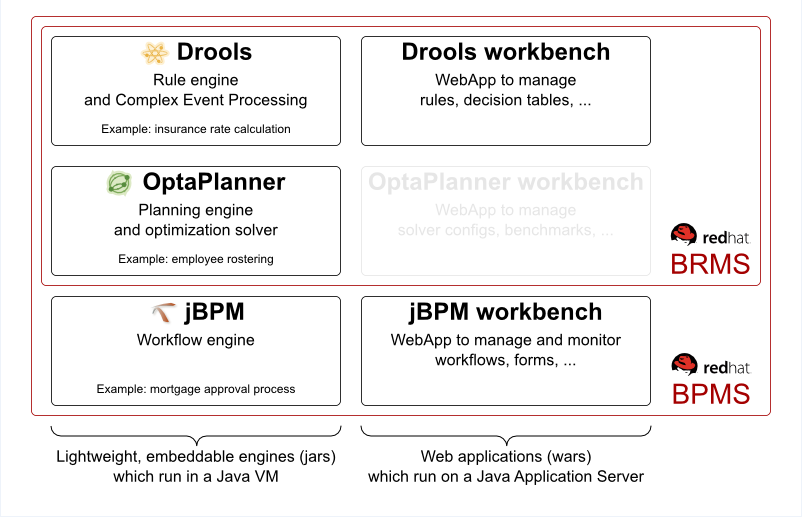

A bit of background +
	•	Business Resource planner was known as Optaplanner +
	•	OptaPlanner had graduated from the Drools project to become a top-level JBoss Community project +
	•	OptaPlanner (the planning engine) joined its siblings Drools (the rule engine) and jBPM (the workflow engine) in the KIE group +
	•	This component is also available in the Red Hat JBoss BRMS 6.1 product which is a sub-set of the JBoss BPM Suite product.

|======
|